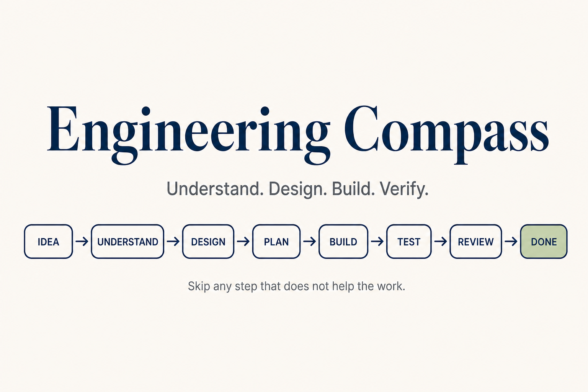

<div align="center">



# Engineering Compass

**Understand. Design. Build. Verify.**

[Why](#why) · [Install](#install) · [Start here](#start-here) · [Guides](#guides)

A small set of skills for coding agents. Use it when you do not know what to do next.

</div>

## Why

Agents need a clear outcome, the constraints that matter, and proof that the work is done. Engineering Compass turns that into nine focused skills.

## Install

```bash
npx skills add MHammad33/hammad-engineering
```

Setup and troubleshooting: [docs/install.md](docs/install.md)

## Start here

| You need to… | Open |
| --- | --- |
| Challenge a new idea | [New idea](docs/new-idea.md) |
| Start a new project | [New project](docs/new-project.md) |
| See what clarity you have at each stage | [From scratch](docs/from-scratch.md) |
| Add a new feature | [New feature](docs/new-feature.md) |
| Fix something broken | [Debugging](docs/debugging.md) |
| Clean up working code | [Improve](docs/improve.md) |

Each guide is a step-by-step workflow. Skills are the tools inside those steps.

Skill name lookup: [docs/choosing-a-skill.md](docs/choosing-a-skill.md)

## Skills

| Group | Skills |
| --- | --- |
| Learn | `understand` |
| Decide | `idea` · `design` · `plan` |
| Deliver | `build` |
| Check | `test` · `review` · `debug` · `improve` |

Instructions live in [`skills/`](skills/). Agent policy lives in [`AGENTS.md`](AGENTS.md).

## Guides

| Guide | Open when |
| --- | --- |
| [New idea](docs/new-idea.md) | Rough own-product idea, not validated yet |
| [New project](docs/new-project.md) | Idea validated, ready for PROJECT.md and repo |
| [From scratch](docs/from-scratch.md) | You want clarity on how the process works stage by stage |
| [New feature](docs/new-feature.md) | Meaningful change in an existing project |
| [Debugging](docs/debugging.md) | Something is broken |
| [Improve](docs/improve.md) | Code works but is hard to maintain |
| [Choosing a skill](docs/choosing-a-skill.md) | You need a skill name or handoff |
| [Workflows](docs/workflows.md) | Short worked examples |
| [Install](docs/install.md) | Skills missing or outdated |

New repos copy [templates/PROJECT.md](templates/PROJECT.md) then [templates/project-AGENTS.md](templates/project-AGENTS.md).

## Project

Engineering Compass is a workflow, not an issue tracker, agent runtime, or stack cookbook. It is tool-neutral. Keep project facts in each project's `PROJECT.md` and `AGENTS.md`.
