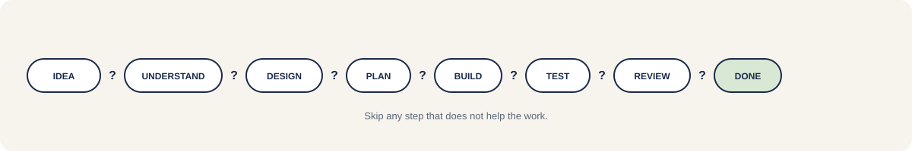

# hammad-engineering

**Understand. Design. Build. Verify.**

[Why](#why) · [Install](#install) · [New project](docs/new-project.md) · [Choose a skill](#choose-a-skill) · [Guides](#guides)

hammad-engineering is your personal AI engineering workflow. Tool-neutral skills and guides that tell you what to do next when working with coding agents.

## Why

Capable agents do not need a script for every move. They need a clear outcome, the constraints that matter, and proof that the work is done.

This repository turns that into a small set of skills: understand the code, decide before expensive changes, build the smallest complete change, verify the result, and review when it matters. Use only the steps the work needs.

The goal is to remove decision fatigue. Open this repo, pick a starting skill, and follow the handoff.

## Install

Install all skills with one command:

```bash
npx skills add MHammad33/hammad-engineering
```

That is the main installation path. Skills are portable files, so the same repository works across compatible coding agents without a separate framework.

Verify, update, and tool-specific setup: [docs/install.md](docs/install.md).

## Choose a skill

Most work starts in one of these places:

- **Start a new project.** Follow [docs/new-project.md](docs/new-project.md). Copy [templates/PROJECT.md](templates/PROJECT.md) before creating the repo.
- **Decide how a meaningful change should work.** Use [`design`](skills/design/SKILL.md) for a technical design ready for your approval.
- **Something is broken.** Use [`debug`](skills/debug/SKILL.md) to find root cause before fixing.

Use [`plan`](skills/plan/SKILL.md) when approved work needs splitting. Use [`understand`](skills/understand/SKILL.md) when you need to read unfamiliar code first.

Small, clear changes can go straight to [`build`](skills/build/SKILL.md). This workflow asks for only as much process as the work needs.

Full skill lookup, handoffs, and skip rules: [Choosing a skill](docs/choosing-a-skill.md).

## Eight skills

- **Learn:** [`understand`](skills/understand/SKILL.md)
- **Decide:** [`design`](skills/design/SKILL.md), [`plan`](skills/plan/SKILL.md)
- **Deliver:** [`build`](skills/build/SKILL.md)
- **Check:** [`test`](skills/test/SKILL.md), [`review`](skills/review/SKILL.md), [`debug`](skills/debug/SKILL.md), [`improve`](skills/improve/SKILL.md)

Each skill owns one kind of work and has a clear stopping point. Repository policy stays in [`AGENTS.md`](AGENTS.md). Project-specific facts stay in each project's `PROJECT.md` and `AGENTS.md`.

## Guides

- [Choosing a skill](docs/choosing-a-skill.md) explains where each skill starts, stops, and what comes next.
- [New project](docs/new-project.md) walks from idea to v1 step by step.
- [Workflows](docs/workflows.md) shows how skills fit together for bugs, features, production issues, and refactors.
- [Install](docs/install.md) covers install, verify, update, and tool setup.

## Templates

- [templates/PROJECT.md](templates/PROJECT.md) — project brief before or at repo creation
- [templates/project-AGENTS.md](templates/project-AGENTS.md) — agent instructions per project

## Project

hammad-engineering is deliberately small. It is not an issue tracker, an agent runtime, or a stack cookbook. It gives you and your coding agents clear instructions for deciding, building, testing, and reviewing software.

It is tool-neutral. Cursor, Codex, Claude Code, or another agent can load the same skills. Tool wiring lives in [docs/install.md](docs/install.md), not in the core workflow.
